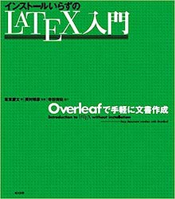
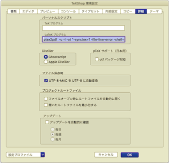
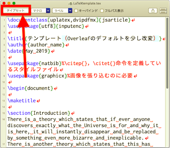
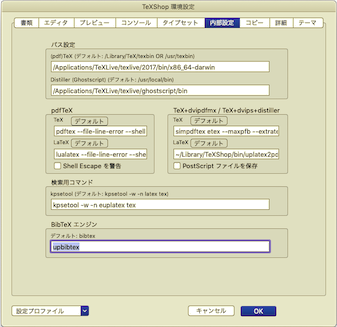
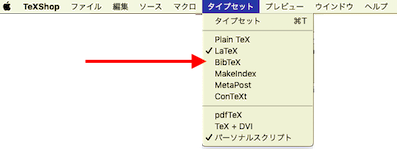
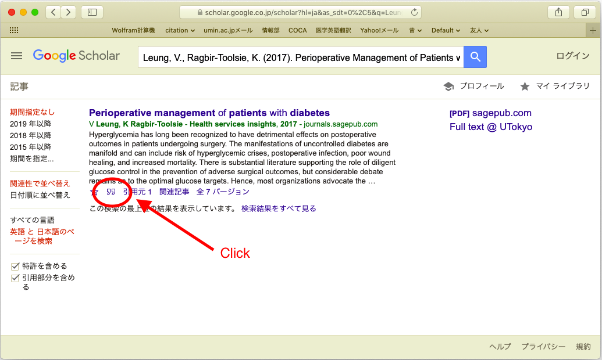
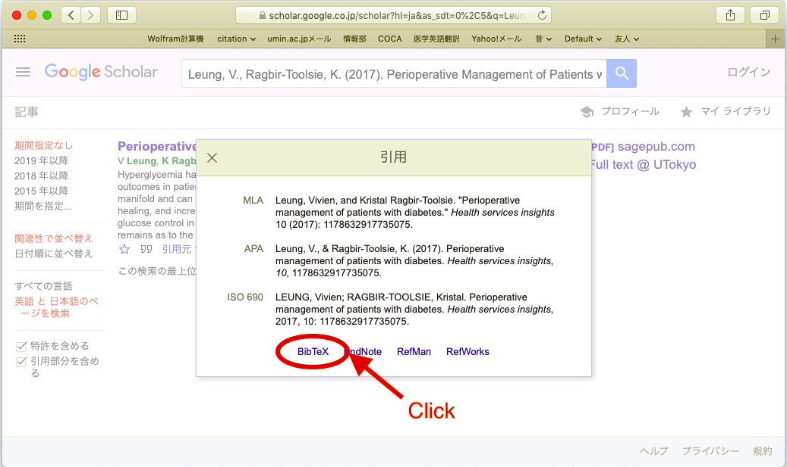
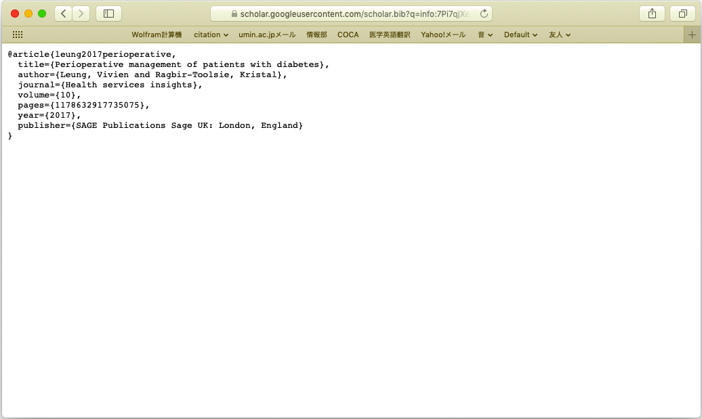

# LaTeXで作るレポート　はじめの１歩

2019/5/15(Wed.) 18:00〜 ＠駒場キャンパス 東大TeX愛好会 domperor（Oura M.）

## LaTeXのインストールは済んでいますか（〜18:00）

***おすすめ：『美文書作成入門』付属インストーラ***。書籍部で買いましょう（いや図書館で借りてもいい）！


- Macの場合：[MacTeX](https://doratex.hatenablog.jp/entry/20190502/1556775026) を使っている人が多い印象。

  本当は TeX Live を```install-tl```した方がよいのだが……

- Windowsの場合：[**あべのりインストーラ**](https://www.ms.u-tokyo.ac.jp/~abenori/soft/abtexinst.html)が便利。

  ただこれでインストールされるのは TeX Live ではなく W32TeX なので TeX Live が必要ならやっぱり TeX Live を```install-tl```しましょう

- Linuxの場合：頑張って TeX Live を```install-tl``` してください
- インストールが面倒な場合：**Overleaf**を使いましょう

## インストール済みの人は‥‥（18:00〜18:10）

せっかくなのでOverleafを使ってみよう！次の本を買うと詳しくなれる！スクリーンショットふんだんでわかりやすい！！



[↑↑↑寺田先生の新刊ですよ！！宣伝！！↑↑↑](https://www.amazon.co.jp/改訂第7版-LaTeX2ε美文書作成入門-奥村-晴彦/dp/4774187054)

1. まずは[Overleaf](https://www.overleaf.com/)にアクセス

2. registerしてlog in

3. New Project -> Example Project を選択，適当にProject Nameを入れてCreate

4. 日本語を使うための初期設定をしましょう

   - 左上 Menu を押す -> Settings で Compliler を pdfLaTeX から LaTeX にする

   -  Menu ボタンの下の New File から ```latexmkrc``` を作る（拡張子なし）

     ```latexmkrc
     $latex='uplatex';
     $bibtex='upbibtex';
     $dvipdf='dvipdfmx %O -o %D %S';
     $makeindex='mendex -U %O -o %D %S';
     $pdf_mode=3;
     ```

   - main.tex の一行目を次のように変更

     ```変更前
     \documentclass{article}
     ```

     ↓

     ```変更後
     \documentclass[dvipdfmx,uplatex]{jsarticle}
     ```

   - main.tex に日本語をいくつか入れて，Recompileしてみましょう。通るはずです。

5. 参考文献を増やしたいときは references.bib をいじります。

   普通，参考文献を増やした後，反映するためには BibTeX コンパイル -> LaTeXコンパイル２回 が必要なのですが，Overleaf では自動化されていて Recompile １回で反映されます！

6. 出来上がった pdf は Downlad PDF ボタンでダウンロードできる

## オフラインでコンパイルしよう（18:10〜18:30）

Overleaf はよくできているが，Internet Connectivity が必要。オフラインでコンパイルできない，というデメリットがある。自前の環境を用意した方が良いのは間違いない。

1. テキストエディタを用意しよう。**TeXShop** や **TeXWorks** がメジャーか（TeX のインストール時に何かしらついてくることが多い）。テキストエディット.app や メモ帳.exe でも良いが，**TeX 言語専用のテキストエディタ**を使うと

   - シンタックスハイライトが美しくてやりやすい。
   - SyncTeX が使える

2. このゼミの github からテンプレートをダウンロードしましょう（Overleafのやつに揃えてある）

   - template/

     　├  LaTeXtemplate.tex

       　├  references.bib

       　└  universe.jpg

3. 最初のコンパイルを通してみましょう

   - 方法１ ターミナルから（Mac）

     - uplatex，dvipdfmx にパスが通っているとして次のようにすればよい。

       :::templateフォルダまでのpath::: は手打ちせず，ドラッグアンドドロップで打ち込むのがスマート。

       ```ターミナル画面
       cd :::templateフォルダまでのpath:::
       uplatex LaTeXtemplate.tex
       dvipdfmx LaTeXtemplate.dvi
       ```

     - パスが通っていなければ通しましょう

       ```ターミナル画面
       open ~/.profile
       ```

       で .profile をテキストエディットで開き，

       ```.profile
       # これは例
       export PATH="/Applications/TeXLive/texlive/2017/bin/x86_64-darwin:$PATH"
       ```

       のような形で uplatex，dvipdfmx の入っているフォルダまでのパスを通す。

     - また，uplatex と dvipdfmx の２回に分けて通すのが面倒なら ptex2pdf を使うと良い。

       ```ターミナル画面
       cd :::templateフォルダまでのpath:::
       ptex2pdf -u -l LaTeXtemplate.tex
       ```

       `-u` （pLaTeX ではなく upLaTeX）オプションと `-l` （TeX ではなく LaTeX）オプションが必要。

       さらに，`-ot` オプションで SyncTeX を使うと感動できる。

       ```ターミナル画面
       cd :::templateフォルダまでのpath:::
       ptex2pdf -u -l -ot "-synctex=1 -file-line-error -shell-escape" LaTeXtemplate.tex
       ```

       `-ot` オプションは，TeX のオプション引数を書く。詳しくは

       ```ターミナル画面
       tex --help
       ```

       とすると出てくる。

   - 方法２ TeXShop や TeXWorks などからコンパイルを通す

     毎回ターミナルにコマンドを打ち込むのが面倒なので，「タイプセット」ボタン１つでいけるようにしておこう！

     - ptex2pdf へのパスは方法１同様に通しておきます

     - TeXShop のときは，「デフォルトのスクリプト（パーソナルスクリプト）」に

       ```LaTeXの欄
       ptex2pdf -u -l -ot "-synctex=1 -file-line-error -shell-escape"
       ```

       と書いておこう。TeXWorks はどこに書くんだろう……

       

     - LaTeXtemplate.tex を開き，タイプセット（Command + T）する。

       

4. BibTeX の反映をしてみよう

   ↑では，BibTeX を走らせていないので，reference の番号が  `(?)` みたいに表示されてしまう。

   - 方法１ ターミナルから（Mac）

     - uplatex，dvipdfmx へのパスを通してあれば，同じ場所で upbibtex へのパスが通っているはず。

       - １回 uplatex コンパイル ＝ upbibtex は入力に .aux ファイルを必要とするため
       -  upbibtex コンパイル（このとき拡張子はいらない）
       - ２回 uplatex コンパイル ＝ １回目で references の番号が正常化，２回目で cite の番号が正常化
       -  dvipdfmx で PDF 出力

       ```ターミナル画面
       cd :::templateフォルダまでのpath:::
       uplatex LaTeXtemplate.tex
       upbibtex LaTeXtemplate
       uplatex LaTeXtemplate.tex
       uplatex LaTeXtemplate.tex
       dvipdfmx LaTeXtemplate.dvi
       ```

     - 最後の１回は ptex2pdf を使った方がコマンドの行数としては節約できる

       ```ターミナル画面
       cd :::templateフォルダまでのpath:::
       uplatex LaTeXtemplate.tex
       upbibtex LaTeXtemplate
       uplatex LaTeXtemplate.tex
       ptex2pdf -u -l -ot "-synctex=1 -file-line-error -shell-escape" LaTeXtemplate.tex
       ```

   - 方法２ TeXShop や TeXWorks などからコンパイルを通す

     - BibTeX エンジンを，bibtex から upbibtex にしておきます

       

     - 次のように繰り返します

       「タイプセット（Command + T）」

       →  BibTeX（★）

       → 「タイプセット（Command + T）」

       →「タイプセット（Command + T）」

       （★）BibTeX は<タイプセット>**プルダウンメニュー**にある。

       

## 引用文献を増やしてみよう（18:30〜18:40）

手軽に実験するなら Google Scholar からコピペするのがよいです。

（長期的に見れば ***Mendeley：おすすめ！*** などの文献管理ソフトを入れた方がよいでしょう）







これを references.bib にコピーしていきます。```\citep{leung2017perioperative} ```などとして引用していきましょう。なお，LaTeXtemplate.tex では natbib を読み込んでいるので`\citep`，`\citet `という書き方になっていますが，natbib を読み込まないデフォルトの状態では`\cite `命令で読み込んでいきます。

natbib のマニュアルにより詳しく書いてあります。

```ターミナル画面
texdoc natbib
```

として natbib マニュアルを表示すると`\citep`，`\citet `の使い方

***より詳しく BibTeX の使い方を勉強されたい方は github の 190310komabamacro.pdf をご覧ください***。BibTeX ゼミの講義資料が入っています。

## ページレイアウトを弄ろう（18:40〜18:50）

- ページサイズを制御する（基本）

  デフォルトのページサイズは `\documentclass` のオプションで指定します。

  ```LaTeXtemplate-detailed.tex
  \documentclass[a4paper,uplatex,dvipdfmx]{jsarticle}
  ```

  ↑では a4paper を指定しましたが，*jsarticle において*一覧は次の通りです。

  - a3paper = 420mm, 297mm
  - a4paper = a4j =297mm, 210mm
  - a5paper = a5j =210mm, 148mm
  - a6paper = 148mm, 105mm
  - b4paper = b4j = 364mm, 257mm
  - b5paper = b5j =257mm, 182mm
  - b6paper = 182mm, 128mm
  - a4var = 283mm, 210mm
  - b5var = 230mm, 182mm
  - letterpaper = 11in, 8.5in
  - legalpaper = 14in, 8.5in
  - executivepaper = 10.5in, 7.25in

  さらに，

  - **landscape オプション**で縦横のサイズを入れ替えられます。

  詳しい仕様は jsarticle.cls 本体を読むとわかります（発展）

- デフォルト文字サイズを制御する

  デフォルトの文字サイズは `\documentclass` のオプションで指定します。

  ```LaTeXtemplate-detailed.tex
  \documentclass[a4paper,10pt,uplatex,dvipdfmx]{jsarticle}
  ```

  ↑では 10pt を指定しましたが，*jsarticle において*一覧は次の通りです。

  - 8pt，9pt，10pt，11pt，12pt，14pt，17pt，20pt，21pt，25pt，30pt，36pt，43pt
  - 12Q，14Q
  - 10ptj，10.5ptj，11ptj，12ptj

  詳しい仕様は jsarticle.cls 本体を読むとわかります（発展）

- 文字サイズを一部大きくしたり小さくしたり（基本）

  `\Huge`，`\huge`，`\Large`，`\Large`，`\large`，`\normalsize`，`\small`，`\footnotesize`，`\scriptsize`，`\tiny `の各命令で制御します。[参考リンク](http://www.latex-cmd.com/style/size.html)

- 余白を制御する（基本）

  プリアンブル部（`\documentclass` 〜 `\begin{document}` の間のこと）に次の書式で書いていきます。コピペして使ってください。

  ```LaTeXtemplate-detailed.tex
  %--余白の設定
  \setlength{\topmargin}{10mm}
  \addtolength{\topmargin}{-1in}
  \setlength{\oddsidemargin}{10mm}
  \addtolength{\oddsidemargin}{-1in}
  \setlength{\evensidemargin}{10mm}
  \addtolength{\evensidemargin}{-1in}
  \setlength{\textwidth}{\paperwidth}
  \addtolength{\textwidth}{-20mm}
  \setlength{\textheight}{\paperheight}
  \addtolength{\textheight}{-20mm}
  \addtolength{\textheight}{-\headheight}
  \addtolength{\textheight}{-\headsep}
  \addtolength{\textheight}{-\footskip}
  \setlength{\topskip}{0mm}
  ```

  例えば，四方の余白を全部10mmにしたければ↑のように書きます。なぜ `-1in` する必要があるのかは[このページ](http://hooktail.org/computer/index.php?%A5%DA%A1%BC%A5%B8%A5%EC%A5%A4%A5%A2%A5%A6%A5%C8)の画像を参照してください。TeX の参照点が 1inch ずれているんですね。**めっちゃこの画像わかりやすいので必ず見てみてください**。

- ヘッダとフッタをつける（基本）

  LaTeX デフォルトで弄るよりも，fancyhdr に頼った方が圧倒的に楽です。

  プリアンブル部（`\documentclass` 〜 `\begin{document}` の間のこと）に次の書式で書いていきます。コピペして使ってください。

  ```LaTeXtemplate-detailed.tex
  %ヘッダ・フッタの設定
  \usepackage{fancyhdr} 
  \pagestyle{fancy} 
  \lhead[偶数ページ左側ヘッダ]{奇数ページ左側ヘッダ} 
  \chead[偶数ページ中央ヘッダ]{奇数ページ中央ヘッダ}
  \rhead[偶数ページ右側ヘッダ]{奇数ページ右側ヘッダ}
  \lfoot[偶数ページ左側フッタ]{奇数ページ左側フッタ} 
  \cfoot[偶数ページ中央フッタ]{奇数ページ中央フッタ} 
  \rfoot[偶数ページ右側フッタ]{奇数ページ右側フッタ} 
  \renewcommand{\headrulewidth}{3pt} %ヘッダの線の太さ 
  \renewcommand{\footrulewidth}{3pt} %フッタの線の太さ
  ```

  しかし，このままではうまく動きません。偶数ページのヘッダ・フッタが奇数ページと同じになってしまいます。偶数ページと奇数ページのヘッダ・フッタを別にするためには， `\documentclass` のオプションで twoside を指定します。

  ```LaTeXtemplate-detailed.tex
  \documentclass[a4paper,10pt,twoside,uplatex,dvipdfmx]{jsarticle}
  ```

  さらに，１ページ目で `\maketitle` した場合，fancyhdr は自動で１ページ目のヘッダ・フッタを抑制してしまいます。しかし完全に抑制する（empty style）のではなく，ページ番号だけは出す（plain style）で出してきます。これを変更するためには `\maketitle`の直後に 

  - `\thispagestyle{empty}`

    あるいは

  - ` \thispagestyle{plain}`

  を書きます。詳しくは

  ```ターミナル画面
  texdoc fancyhdr
  ```

  として fancyhdr マニュアルを表示しましょう。

- **ここまでの内容を反映した詳し目のテンプレートを LateXtemplate-detailed.tex として入れてあります。**

- ページ余白とページサイズを自在に弄る geometry パッケージ（発展）

  余白の書き方はすでに示した通りですが，なかなか覚えられるものではありません（だからこそのコピペ推奨）。geometry パッケージを使えば，短いコードで余白・ページサイズを弄ることができます。**というかこっちの方が初心者向け説ある**。

  例えば，四方の余白を全部10mmにしたければ次のようにプリアンブル部（`\documentclass` 〜 `\begin{document}` の間のこと）に書くだけ。

  ```LaTeXtemplate-detailed.tex
  \usepackage[margin=10mm]{geometry}
  ```

  これだけではなく，ページサイズの指定もできます。次のように。

  ```LaTeXtemplate-detailed.tex
  \usepackage[a4paper,margin=10mm]{geometry}
  ```

  他の機能もあります。詳しくは

  ```ターミナル画面
  texdoc geometry
  ```

  として geometry マニュアルを表示しましょう。

## あとは好きに作ってみましょう！（18:50〜19:00）

コマンド集が色々なところに落ちています。太字にしたいとか，数式を打ち込みたいとか，色々要望が出てくるたびに**ググる or 美文書作成入門を参照**するのが良いでしょう。以下リンク集。

- [コマンド集1](http://www.latex-cmd.com)

- [コマンド集2](http://www002.upp.so-net.ne.jp/latex/)
- [コマンド集3](http://www1.kiy.jp/~yoka/LaTeX/latex.html)
- [チートシート：１枚の紙にまとめたやつ](https://blog.wtsnjp.com/2017/12/31/platexcheat-jsclasses/)

