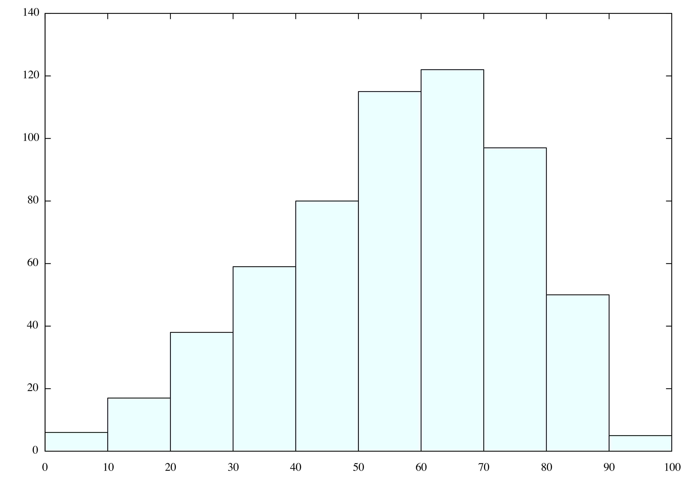

# 2020/09/09 TeX愛好会ゼミ 小ネタ datatoolパケージはどれくらい遅いのか？

分析・文責 @domperor

## まえがき

最近私はよくデータベースを触る。基本的にはシェル芸でなんとかしている（最近USP友の会にも入った）のだが，はてさてTeX愛好会員としてはTeX言語でやってみたいと思い立つものだろう。うむ。ここで，LaTeXでデータベースを弄る為の`datatool`パケージというものがある。

```bash
texdoc datatool
```

で説明書が読める。その説明書には**赤ワク**でたくさん警告⚠️が並んでいる。

- Whilst TeX is an excellent typesetting language, ***it is not designed as a database management system***, and attempting to use it as such is like trying to fasten a screw with a knife instead of a screwdriver: it can be done, but requires great care and is more time consuming. Version 2.0 of the datatool package uses a completely different method of storing the data to previous versions. As a result, the code is much more efficient, however, ***large databases and complex operations will still slow*** the time taken to process your document. Therefore, if you can, it is better to do the complex operations using whatever system created the data in the first place.

まあ，それはそう。じゃあ，どれくらい使い物にならないのか，実験してみようじゃないか。

## 使うデータベースとタスク

FDAの薬剤副作用データベース。医学部生っぽいチョイスでしょ。データベースの区切り文字は`,`ではなく，`$`。2020年4-6月のデータを使う。たとえば，その中のひとつDRUG20Q2.txtは1825415行。

https://fis.fda.gov/content/Exports/faers_ascii_2020Q2.zip

タスクとしては，

1. REAC20Q2.txt（有害反応の症状データ）に入っているCardiomyopathy（心筋症）やMyocarditis（心筋炎）の行を検索して，対応するcaseid（症例ID）を抜き出す。
2. 前の作業で抜き出したcaseidに対応する
   - 第一被疑薬をDRUG20Q2.txtから抜き出す。
   - 年齢データをDEMO2020Q2.txtから抜き出す。
3. 前の作業で抜き出した
   - ５件以上ヒットした第一被疑薬を，ヒット数順に並べる。
   - 年齢データをヒストグラムで表示する。

## まあ，まずはシェル芸で

シェル芸といっても基本的っぽい使い方しかしてないですが。（bashは遅い！と言っている人を見かけますが，pandasとそんなに変わんない気がする。遅さではなくわかりやすさが問題だというならわかる。意外なところのスペースの有無で詰んだり，エラーメッセージがすこぶるわかりにくかったりするのはTeXに似たものを感じますっ……^^;）

### 被疑薬

```bash
cd path/to/faers_ascii_2020Q2/ASCII
grep -e 'cardiomyopathy' -e 'Cardiomyopathy' -e 'Myocarditis' -e 'myocarditis' REAC20Q2.txt | awk -F'[$]' '{print $2}' | sort | uniq >| cardiomyopathy_caseid.txt
cat DRUG20Q2.txt | awk -F'[$]' '$4 == "PS" {print $2","$5}' | sort | uniq >| Drug_caseid.txt
join -t, -1 1 -2 1 -o 2.2 cardiomyopathy_caseid.txt Drug_caseid.txt | sort | uniq -c | sed 's/^ *//g' | sort -k1 -r -n | awk -F'[ ]' '$1 > 4 {print $0}'
```

結果 23秒

```
28 OPDIVO
27 NIVOLUMAB
23 KEYTRUDA
15 ENTRESTO
14 OLANZAPINE.
11 FLUOROURACIL.
11 CAPECITABINE.
10 HUMIRA
10 CLOZARIL
10 CLOZAPINE.
10 CARBOPLATIN.
10 ARIPIPRAZOLE.
9 METFORMIN
8 Hydroxychloroquine
7 PREDNISONE.
7 IMBRUVICA
7 HYDROXYCHLOROQUINE
7 ATEZOLIZUMAB.
6 YERVOY
6 XARELTO
6 TESTOSTERONE.
6 OXALIPLATIN.
5 PEMBROLIZUMAB.
5 OPSUMIT
5 FLUOROURACIL (Manufacturer unknown)
5 DOXORUBICIN HYDROCHLORIDE.
5 DOXORUBICIN
5 DOXIL
```

### 続いて年齢

```bash
cat DEMO20Q2.txt | awk -F'[$]' '$15 == "YR" {print $2","$14}' | sort | uniq >| Demo_caseid.txt
join -t, -1 1 -2 1 -o 2.2 cardiomyopathy_caseid.txt Demo_caseid.txt | sort -n  | gnuplot -e 'set nokey;set style fill solid 1.0 border linecolor rgb "black";filter(x,y)=int(x/y)*y+y/2;plot "-" u (filter($1,10)):(1) smooth frequency with boxes linecolor rgb "light-cyan";'
```

結果 9秒



## 続いて，TeX芸人していきましょう

### はじめの一歩

まず，最初のコマンド

 `grep -e 'cardiomyopathy' -e 'Cardiomyopathy' -e 'Myocarditis' -e 'myocarditis' REAC20Q2.txt | awk -F'[$]' '{print $2}' `  に相当する部分をやっていきます。しかし，「**を含む」という検索条件がないので，cardiomyopathy，Cardiomyopathy，Myocarditis，myocarditisのそれぞれに対する完全一致検索になってしまいます。その問題はのちのち解決するとして，とりあえずCardiomyopathyの完全一致だけでも検索してみましょう。

```latex
\documentclass{article}
\usepackage{datatool}
\begin{document}

\DTLsetseparator{$}
\DTLloaddb{REAC}{REAC20Q2.txt}
\DTLfetch{REAC}{pt}{Cardiomyopathy}{caseid}

\end{document}
```

……オット，はやくも終わる気配がありません。暗雲が立ち込めてきました。コマンドがあっているかも確かめられないのは困るので，とりあえず最初の10000行だけ検索させてみます。

```bash
cat REAC20Q2.txt | head -10000 > R10000.txt
```

そして，次のように変更してもう一回。

```latex
\DTLloaddb{REAC}{R10000.txt}
```

困ったことにこれでも終わる気配がない。`grep -n`でカンニングして6000-6400行に２つあることを知っているので，これでうまくいくかやってみます。さすがに400行なら頑張れ。

```latex
\DTLloaddb{REAC}{R400.txt}
```

しかし……２つ中１つしかヒットしなかった。説明書を読むと，確かに，ヒットした最初のやつだけを表示するとのこと。。。完全一致検索ができず，全検索もできず，147行目のものを見つけてexitするまでに８秒かかっているので，かなりやばい。

### 計算速度の推定

147行目のものをヒット（して，文書コンパイル終わるまで，以下略）にかかる時間は８秒。

300行増やした。447行目のものをヒットするのにかかる時間は……25秒。

さらに300行増やした。747行目のものをヒットするのにかかる時間は……64秒。

さらに300行増やした。1047行目のものをヒットするのにかかる時間は……156秒。

明らかに**時間の増え方が線形ではない**。grepみたいな作業って非線形なんだっけ？あれれ？？

### 戦意を喪失した。

joinも，機能としてはあります。もう，参考リンク貼るだけで丸投げするのが自分の残存戦意での限界です。

https://tex.stackexchange.com/questions/315528/merge-two-csv-files-and-add-missing-rows

そして，datapie.sty（円グラフ作成用）やdataplot.sty（散布図・折れ線グラフ作成用），databar.sty（棒グラフ作成用）が標準で付属しているので，これを使えばヒストグラムまで綺麗にかけるはずだった……

ヒストグラムはまあ，pgfplotsに丸投げしても良いと思いますけど，ね。

## まとめ

まさか最初のgrepの時点ですでにつまづくとは思わなかった。少なくとも自分の研究用途には無理っぽいし，まともに扱えるデータベースの大きさは100行程度かもしれません。あくまでもホビー用途と思っておくのがよさそうです！

疲れたので，本質を貼っておきますね。

⛄️ｶﾜ(・∀・)ｲｲ!!
